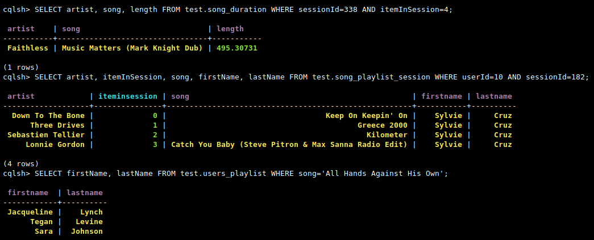

# Introduction
In the <code>**event_data**</code> file, there is a set of CSV files, partitioned by date. Here are
examples of filepaths to two files in the dataset:
```
event_data/2018-11-08-events.csv
event_data/2018-11-09-events.csv
```  
The project is to create an Apache Cassandra database in which we could analyse the dataset in a easier way, creating tables to perform queries like the following queries:
#### 1st query
```
cqlsh> SELECT artist, song, length FROM test.song_duration WHERE sessionId=338 AND itemInSession=4;
``` 
#### 2nd query
```
cqlsh> SELECT artist, song, firstName, lastName FROM test.song_playlist_session WHERE userid=10 AND sessionid=182;
``` 
#### 3rd query
```
cqlsh> SELECT firstName, lastName FROM users_playlist WHERE song = 'All Hands Against His Own';
``` 

## Usage
To insert the data in the database in a easier way, run <code>etl_pipeline.py</code> to reestruct the dataset inserting all the files in a single CSV file, wich is going to be created as <code>**new_event_data.csv**</code>. Now you've got a new file, run <code>db_connect.py</code> to create the tables and insert the data in the database. Then, run some queries to check if it's done. 
<br>
<br>
<div style="text-align:center"></div>
<br>
<br>
To drop the tables and close the connection, just run <code>db_drop.py</code>.